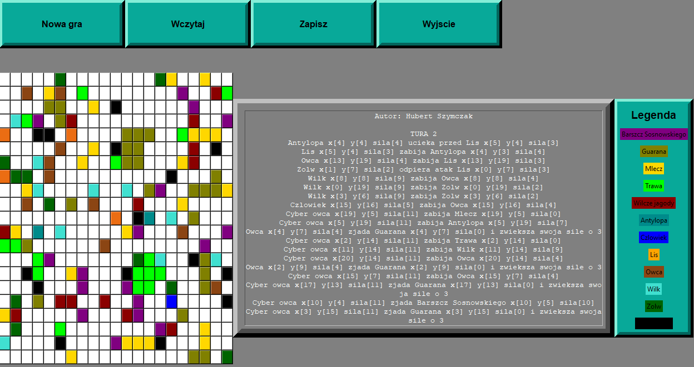

# Virtual World Simulator (Python)

    

## Description
This project is another extension of the Virtual World Simulator, implemented in Python using the Tkinter library for graphical user interface (GUI). This version retains the core functionalities of the original C++ version but provides a graphical interface to enhance user interaction. The simulator models a dynamic virtual ecosystem on a 2D grid, where various types of organisms exhibit unique behaviors and interact in complex ways.

## Features
- **Graphical Interface**: Utilizes Tkinter for a user-friendly GUI.
- **Customizable World Size**: Define the size of the 2D grid.
- **Organism Types**: Includes multiple animal species (including cyber-sheep) and plant species with distinct behaviors.
- **Turn-Based Simulation**: Organisms perform actions based on their type in each turn.
- **Human Character**: Controlled by the player using keyboard arrows with a special ability.
- **Collision Handling**: Manages interactions when organisms occupy the same cell.
- **Organism Behavior**:
  - **Animals**: Move, reproduce, and engage in conflicts.
  - **Plants**: Spread to adjacent cells.
- **Event Reporting**: Displays updates on interactions, fights, and other events.
- **Save and Load**: Allows the game state to be saved to a file and loaded from a file, enabling you to continue your simulation from where you left off.

## Classes and Methods

### Class `World` (Swiat)
Manages the game world and its organisms.
- **Methods**:
  - `execute_turn()`: Executes a turn.
  - `draw_world()`: Draws the current state of the world.
- **Fields**:
  - `organisms`: List of organisms in the world.

### Class `Organism` (Organizm)
Abstract base class for all organisms.
- **Fields**:
  - `strength` (siła)
  - `initiative` (inicjatywa)
  - `position` (położenie)
  - `world` (świat)
- **Methods**:
  - `action()`: Defines the organism's behavior during a turn.
  - `collision()`: Defines the organism's behavior during a collision.
  - `draw()`: Draws the organism.

### Subclasses
- **Animal (`Zwierze`)**: Implements common behaviors for animals, such as movement and reproduction.
- **Human (`Człowiek`)**: Extends `Zwierze`, controlled by the player, with a special ability.
- **Plant (`Roślina`)**: Implements common behaviors for plants, such as spreading.

## Implementation Details
- Implemented the game world and its visualization using Tkinter.
- Included all required animal species (including cyber-sheep) and plant species.
- Implemented human character movement via keyboard.
- Implemented the human's special ability.
- Provided functionality to save and load the state of the virtual world.

